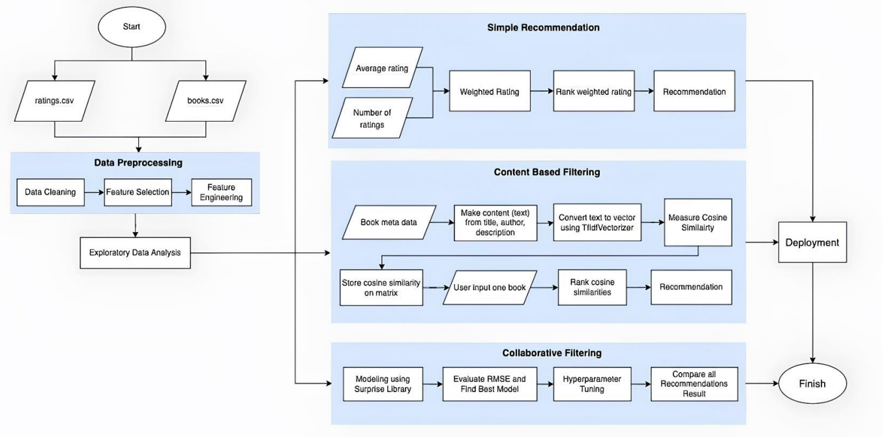

# 1. PROJECT DESCRIPTION

### 1.1 INTRODUCTION

A recommender system, or a recommendation system (sometimes replacing "system" with
terms such as "platform", "engine", or "algorithm"), is a subclass of information filtering
system that provides suggestions for items that are most pertinent to a particular user.
Recommender systems are particularly useful when an individual needs to choose an item
from a potentially overwhelming number of items that a service may offer.

Recommender systems are beneficial to both service providers and users. They reduce
transaction costs of finding and selecting items in an online shopping environment.
Recommendation systems have also proved to improve decision making process and
quality. In e-commerce setting, recommender systems enhance revenues, for the fact that
they are effective means of selling more products. In scientific libraries, recommender
systems support users by allowing them to move beyond catalog searches. Therefore, the
need to use efficient and accurate recommendation techniques within a system that will
provide relevant and dependable recommendations for users cannot be over-emphasized.

### 1.2 PHASES OF RECOMMENDATION PROCESS

1.2.1 Information Collection Phase
This collects relevant information of users to generate a user profile or model for
the prediction tasks including user’s attribute, behaviors or content of the resources
the user accesses. A recommendation agent cannot function accurately until the user
profile/model has been well constructed. The system needs to know as much as
possible from the user in order to provide reasonable recommendation right from
the onset. Recommender systems rely on different types of input such as the most
convenient high quality explicit feedback, which includes explicit input by users
regarding their interest in item or implicit feedback by inferring user preferences
indirectly through observing user behavior.




1.2.1.1 Explicit feedback
The system normally prompts the user through the system interface to provide
ratings for items in order to construct and improve his model. The accuracy of
recommendation depends on the quantity of ratings provided by the user. The only
shortcoming of this method is, it requires effort from the users and also, users are
not always ready to supply enough information. Despite the fact that explicit
feedback requires more effort from user, it is still seen as providing more reliable
data.

1.2.1.2 Implicit feedback
The system automatically infers the user’s preferences by monitoring the different
actions of users such as the history of purchases, navigation history, and time spent
on some web pages, links followed by the user, content of e-mail and button clicks
among others. Implicit feedback reduces the burden on users by inferring their
user’s preferences from their behavior with the system. The method though does
not require effort from the user, but it is less accurate.

1.2.2 Learning Phase
It applies a learning algorithm to filter and exploit the user’s features from the
feedback gathered in information collection phase.

1.2.3 Prediction/Recommendation Phase
It recommends or predicts what kind of items the user may prefer. This can be made
either directly based on the dataset collected in information collection phase which
could be memory based or model based or through the system’s observed activities
of the user. Fig. 8.2.1 highlights the recommendation phases.

Example :


## 1.3 SYSTEM FLOWCHART


## 1.4 DATA UNDERSTANDING

This dataset was originally scraped from the Goodreads API in September 2017 by
Zygmunt Zając and updated by Olivier Simard-Hanley. You can download the data from
this GitHub repository.

```
Figure 4 Dataset Info
```
It contains two different dataset

1.Ratings.csv – userid, bookid, rating

2. BookMetaData.csv – title, bookid, avg_rating, rating_count, description, genre,
publishDate, author

```
Figure 3 System Flowcart
```

## 1.5 EXPLORATORY DATA ANALYSIS

```
❖ How is the rating for all books distributed?
```
```
Figure 5 Average Rating Distribution
```
```
Since this is the list of 10,000 popular books, the majority of the books have an
average value of 4.02.
```
```
❖ Does rating count affect the average rating?
```
```
Figure 6 Rating vs count
```

People who rate < 50 books tend to give higher ratings. People start to give lower rating if
they read more books. This could be a result of an inappropriate book recommendation
system, so that people end up reading books they don't like.

```
❖ Top rated books
```
```
Figure 7 Top Books
```
```
❖ Author with maximum books & Rating
```
```
Figure 8 Top Authors
```
```
Here, If we see the author with respect to rating then, J.K. Rowling, Suzanne Collins
followed by Stephenie Meyer.
```

```
Figure 9 Author with Max books
```
```
But, James Patterson followed by Stephen King & Nora Roberts have Maximum
Number of books.
```
❖ Genre Distribution

```
Figure 10 Genre Distribution
```
```
In all listed genres Fiction is most rated followed by fantasy & romance.
```

## 1.6 MODELLING TECHNIQUES

1.6.1 Simple Recommender System

❖ This is non-personalized recommender. A popularity-based recommendation
system suggests items that are currently trending, such as products that are often
purchased by new users. This system provides a general chart of recommended items
to all users, and is not sensitive to the interests and tastes of a particular user. Popularity-
based recommender systems are easy to understand and implement, and are fast to
train. They are also effective as an initial approach.

❖ One of the easiest way to give recommendation is to rank the book based on rating
average_rating or ratings_count.
❖ However, as we mentioned in EDA, we need to make a weighted rating of
average_rating and rating_count.

New Rating Score formula used in Internet Movie Database (IMDb)

```
Figure 11 New Rating Score Formula
```
```
where:
v = number of ratings ( ratings_count )
m = minimum ratings_count required to be recommended
R = average of ratings ( average_rating )
C = the mean ratings for all book
```
1.6.2 Content – Based Filtering

❖ Content-based filtering uses item features to recommend other items similar to what the
user likes, based on their previous actions or explicit feedback.

❖ This approach makes recommendations to users based on the features or characteristics
of the books. Using item metadata, the computer will assess how similar the books are
to one another and then recommend the books that are most like the one the user loved.
One of the way is using cosine similarity. It calculates the cosine of the angle between
two vectors, representing the attributes or features of items.

```
Figure 12 Content Based Filtering
```

### 1.6.2.1 TF-IDF :

```
TF-IDF is a numerical statistic that reflects the importance of a term (word) within
a document (book) relative to a collection of documents (corpus). It's widely used
in natural language processing and information retrieval tasks, including content-
based recommendation systems.
```
1. Term Frequency (TF): This component measures how often a term appears in a
document. Essentially, TF captures the local importance of a term within a
document.

```
TF(t,d) = Number of times word in document / Number of total word in document
```
2. Inverse Document Frequency (IDF): IDF measures how important a term is
across the entire corpus of documents. IDF reflects the global importance of a term
by penalizing terms that appear frequently across all documents.

```
iDF(t,D) = log( total no. of document in corpus D / Number of document containing
t) + 1
```
3. TF-IDF Score: The TF-IDF score combines both TF and IDF to measure the
importance of a term in a specific document relative to its importance across all
documents. The higher the TF-IDF score for a term in a document, the more
important that term is for that document relative to the entire corpus.

```
tf-idf(t, d) = tf(t, d) * idf(t)
```
1.6.2.2 Cosine Similarity

```
Figure 13 Cosine Similarity
```
1. Vector Representation: Each item
is represented as a vector in a multi-
dimensional space, where each
dimension corresponds to a feature or
attribute of the item.
2. Similarity Calculation: To
determine how similar two items are,
cosine similarity measures the cosine
of the angle between their feature
vectors. It ranges from -1 to


1.6.3 Collaborative Filtering

The motivation for collaborative filtering comes from the idea that people often get the best
recommendations from someone with tastes similar to themselves. Collaborative filtering
encompasses techniques for matching people with similar interests and
making recommendations on this basis.

```
Figure 14 Collaborative Filtering
```
1.6.3.1 Matrix Factorization

Matrix factorization is a simple embedding model. Given the feedback matrix A ∈ R (m*n),
where m is the number of users (or queries) and n is the number of items, the model learns:

- A user embedding matrix U∈R(m×d), where row i is the embedding for user i.
- An item embedding matrix V∈R(n×d), where row j is the embedding for item j.

## Figure 15 Matrix Factorization

- The embeddings are learned such that the product _UV**T_ is a good approximation
    of the feedback matrix A.


